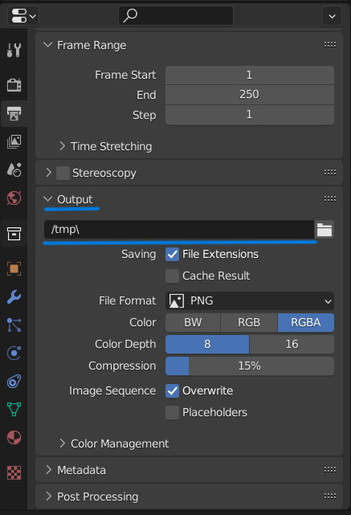

# pont.tech cloud Blender plugin
This plugin allows you to connect to pont.tech cloud services directly from blender. It integrates seamlessly, and does not require any actions from the user after setup.
It uses our universal [server](https://github.com/pont-tech/pont-server) on backend.

Tested on Blender 3.0, 3.1, 3.2, 3.3

## Installation
Download the latest zip from the [release page](https://github.com/pont-tech/pont-blender-plugin/releases). Inside Blender go to Edit -> Preferences, then  hit Install Add-On and choose the downloaded archive.

## Demo
Check out fill video on [YouTube](https://youtu.be/jpVhTIPdqQk)

## Usage
After plugin is enabled and installed pont.tech panel will appear in `Render` section of the scene properties. Find it and set the address to point to pont.tech cloud api: [api.ponttech.keentic.pro](api.ponttech.keentic.pro).
Finally set output folder at `Output` properties panel. After that you can render. Upscaled interpolated images would appear next to original ones in defined output folder.

 

